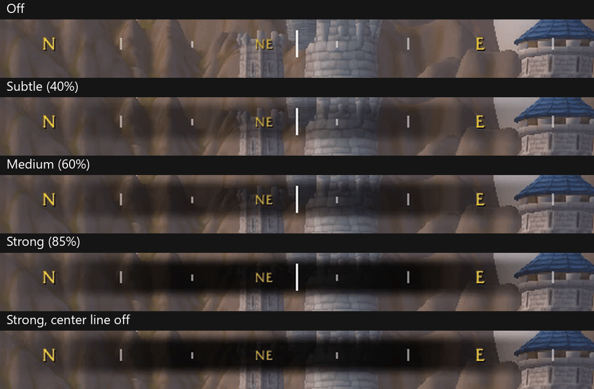

# Wayfinder

Welcome to Wayfinder, an addon for World of Warcraft that enhances your navigation experience with a compass banner.

## Table of Contents

- [Wayfinder](#wayfinder)
  - [Table of Contents](#table-of-contents)
  - [Installation](#installation)
  - [Usage](#usage)
  - [Compatibility](#compatibility)
  - [Commands](#commands)
  - [Contributing](#contributing)
  - [License](#license)

## Installation

1. Download the latest release from the [Releases](https://github.com/wyomarus/wayfinder/releases) page.
2. Extract the contents of the zip file to your World of Warcraft `Interface/AddOns` directory.
3. Ensure the folder is named `Wayfinder`.

## Usage

Once installed, Wayfinder will automatically display a compass banner at the top of your screen when you log into the game. The banner shows cardinal and intercardinal directions plus a marker, distance, and ETA readout for whatever you're currently super-tracking (a quest, a waypoint, a corpse run, etc.). It hides itself anywhere the game doesn't report which way you're facing (inside most dungeons, for example), rather than leave the compass frozen, and the settings page says so when it does.

The banner is locked in place by default; `/wayfinder unlock` it to drag it to a new spot, then `/wayfinder lock` it back down - see [Commands](#commands).

A dark fade can be put behind the banner (Off, Subtle, Medium or Strong) to keep the directions readable over bright scenery, and the line at its center can be turned off. Both are in the settings.

SuperTracking currently follows quests, user-placed waypoints, area POIs, taxi nodes, and your own corpse. Other trackable target types (scenarios, world content, party members, vignettes) aren't handled yet, so the marker just won't appear for those.

All of the above is configurable from a "Wayfinder" panel in the game's own Settings (Escape > Options > AddOns), reachable with `/wayfinder settings` or from the minimap's Addon Compartment dropdown, which also toggles the banner with a click.

## Compatibility

Wayfinder is developed and tested first on WoW: Forever. The other clients get less testing, and Classic Era is new and experimental.

| Client | Interface | Status | Notes |
| --- | --- | --- | --- |
| WoW: Forever (beta) | 16001 | Primary | Everything. Checked before every release. |
| Retail | 120100 | Supported | Everything. Checked when convenient. Blizzard's own tracking is better here, so you may prefer to turn Wayfinder's tracking off in its settings. |
| Classic Era | 11509 | Experimental | The compass banner, its background and center line, the compass detail levels and the settings page. SuperTracking (the marker, distance and ETA) isn't available, because Classic Era doesn't have the game features it relies on. |

Please report problems on [GitHub Issues](https://github.com/wyomarus/Wayfinder/issues) and say which client you're using.

## Commands

All commands are available under `/wayfinder` or the shorter `/wf`.

| Command | Effect |
| --- | --- |
| `/wayfinder show` | Show the compass banner |
| `/wayfinder hide` | Hide the compass banner |
| `/wayfinder lock` | Lock the compass banner in place |
| `/wayfinder unlock` | Unlock the compass banner so it can be dragged to a new position |
| `/wayfinder resetposition` | Reset the compass banner to its default position |
| `/wayfinder settings` | Open the Wayfinder settings panel |
| `/wayfinder compass enable\|disable` | Enable or disable the cardinal/intercardinal direction markers |
| `/wayfinder detail <0-3>` | Set how much compass detail is shown (0 = none, 3 = cardinals + intercardinals + 15° ticks) |
| `/wayfinder centerline enable\|disable` | Show or hide the line at the center of the banner |
| `/wayfinder background <0-3>` | Set the strength of the dark fade behind the banner (0 = none, 3 = strong) |
| `/wayfinder tracking enable\|disable` | Enable or disable the SuperTracking marker |
| `/wayfinder distance enable\|disable` | Show or hide the SuperTracking distance readout |
| `/wayfinder eta enable\|disable` | Show or hide the SuperTracking ETA readout |
| `/wayfinder debug tracking` | Print SuperTracking diagnostic info, for troubleshooting a missing marker |

## Contributing

Bug reports, feature requests, and pull requests are welcome via [GitHub Issues](https://github.com/wyomarus/Wayfinder/issues) and [Pull Requests](https://github.com/wyomarus/Wayfinder/pulls). See [DEVNOTES.md](DEVNOTES.md) for the project's coding conventions.

## License

See LICENSE.md
